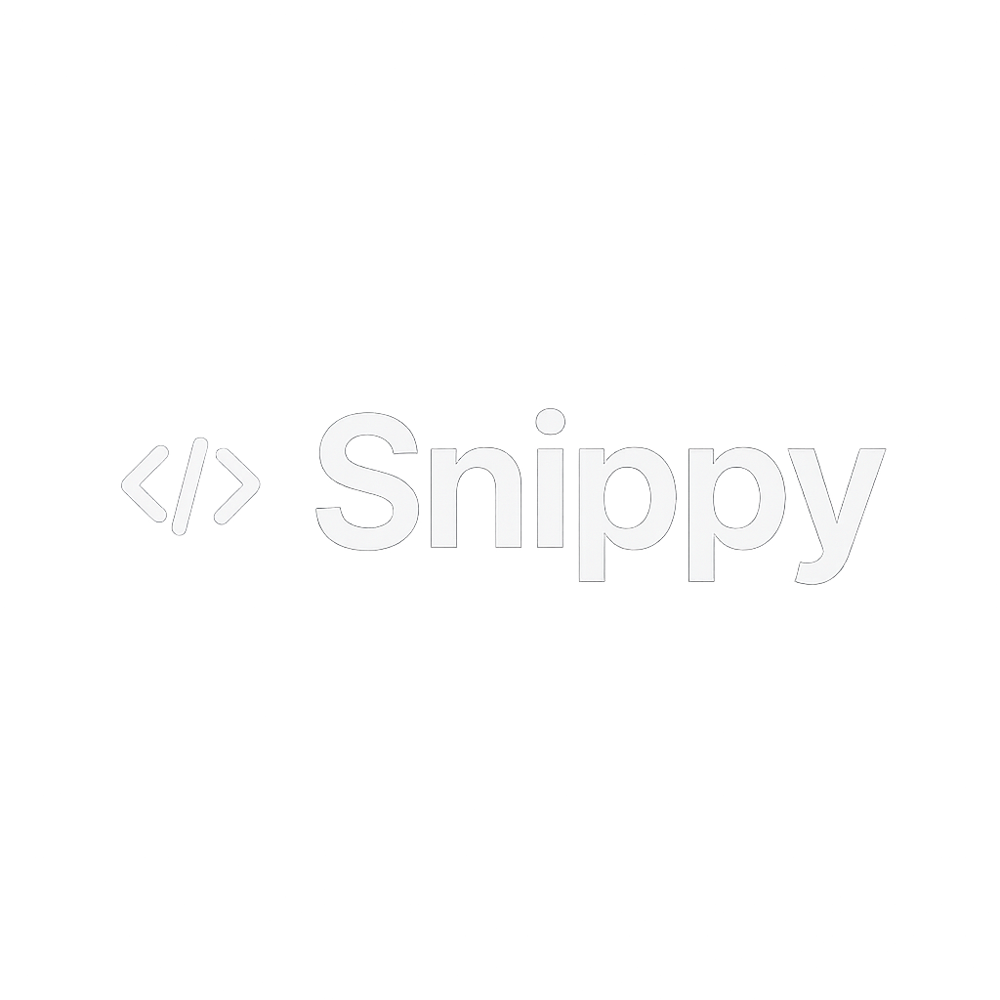

# 🚀 Snippet Master – AI-Powered Code Snippet Management Platform

## 📝 Project Overview

**Snippet Master** is a comprehensive, real-time code snippet sharing and management platform for developers, teams, and coding communities. It combines AI-powered code analysis, intelligent organization, real-time collaboration, and seamless sharing capabilities—empowering developers to discover, create, and share high-quality code snippets with advanced features and insights.

---

## 🌟 Key Features

- **AI-Powered Code Analysis**
  - **Google AI Integration:** Advanced code analysis using Google's Generative AI for quality assessment, best practices, and improvement suggestions.
  - **Automatic Documentation Generation:** Instantly create comprehensive documentation for any code snippet with AI assistance.
  - **Code Quality Scoring:** Get detailed feedback on code structure, efficiency, and adherence to best practices.
  - **Language Conversion:** Seamlessly convert code between supported programming languages with AI assistance.

- **Smart Snippet Management**
  - **Rich Code Editor:** Advanced syntax highlighting and code formatting for 50+ programming languages.
  - **Intelligent Tagging System:** Comprehensive tagging with 200+ predefined tags covering languages, frameworks, patterns, and concepts.
  - **Privacy Controls:** Choose between public and private snippets with granular access control.

- **Real-Time Collaboration & Sharing**
  - **Socket.IO Integration:** Live updates for new snippets, likes, and community activity without page refresh.
  - **QR Code Sharing:** Generate instant QR codes for easy snippet sharing via mobile devices.
  - **Direct Link Sharing:** One-click copy and share functionality for seamless collaboration.
  - **Live Status Indicators:** Real-time connection status and user activity tracking.

- **Advanced Search & Discovery**
  - **Full-Text Search:** Powerful search across snippet titles, descriptions, and code content.
  - **Tag-Based Filtering:** Filter by programming language, framework, concept, or custom tags.
  - **Popular & Trending:** Discover trending snippets and top contributors in the community.
  - **Smart Suggestions:** AI-powered recommendations based on your coding patterns and interests.

- **User Experience & Social Features**
  - **Favorites System:** Save and organize your most-used snippets for quick access.
  - **Leaderboard:** Community-driven ranking system showcasing top contributors and popular snippets.
  - **User Profiles:** Comprehensive profiles with snippet collections, achievements, and social features.
  - **Responsive Design:** Beautiful, modern UI that works seamlessly across all devices.

- **Authentication & Security**
  - **JWT-Based Authentication:** Secure user registration, login, and session management.
  - **Email Verification:** Robust email verification system for account security.
  - **Password Reset:** Secure password recovery via email with token-based validation.
  - **Profile Management:** Update personal information, bio, social links, and profile pictures with Cloudinary integration.

- **Modern Dashboard & Analytics**
  - **Personal Dashboard:** Overview of your snippets, favorites, and community activity.
  - **Performance Analytics:** Track snippet popularity, views, and engagement metrics.
  - **Dark Mode Support:** Beautiful dark theme for comfortable coding sessions.
  - **Accessibility Features:** WCAG compliant design for inclusive user experience.

- **File Management & Cloud Integration**
  - **Cloudinary Integration:** Secure file uploads for profile pictures and media content.
  - **Image Optimization:** Automatic image compression and optimization for better performance.
  - **CDN Delivery:** Fast, global content delivery for uploaded assets.

---

## 🛠️ Tools & Technologies

- **Frontend:** Next.js 14, React 18, TypeScript, TailwindCSS
- **Backend:** Node.js, Express.js, MongoDB with Mongoose
- **Real-Time:** Socket.IO for live updates and collaboration
- **AI Integration:** Google Generative AI for code analysis and documentation
- **Authentication:** JWT tokens with bcrypt password hashing
- **File Storage:** Cloudinary for image uploads and management
- **Email Services:** Nodemailer with Handlebars templates
- **UI Components:** Radix UI, Lucide React icons, Framer Motion
- **Code Highlighting:** React Syntax Highlighter with 50+ language support
- **QR Code Generation:** QRCode library for snippet sharing
- **Form Handling:** React Hook Form with validation
- **State Management:** React Context API with custom hooks

---

## 🚦 Getting Started

### 1. Set Up Environment Variables

Create a `.env` file in the backend directory and add:

```env
MONGODB_URI=your_mongodb_connection_string
JWT_SECRET=your_jwt_secret_key
CLOUDINARY_CLOUD_NAME=your_cloudinary_cloud_name
CLOUDINARY_API_KEY=your_cloudinary_api_key
CLOUDINARY_API_SECRET=your_cloudinary_api_secret
GOOGLE_AI_API_KEY=your_google_ai_api_key
EMAIL_USER=your_email_address
EMAIL_PASS=your_email_password
FRONTEND_URL=http://localhost:3000
```

### 2. Install Dependencies

**Backend:**
```bash
cd backend
npm install
```

**Frontend:**
```bash
cd client
npm install
```

### 3. Set Up the Database

Ensure MongoDB is running and accessible with the connection string provided in your environment variables.

### 4. Run the Application

**Backend:**
```bash
cd backend
npm run dev
```

**Frontend:**
```bash
cd client
npm run dev
```

---

## 🌐 Deployment

1. Set up environment variables on your hosting platform (Vercel, Railway, Render, etc.)
2. Deploy the backend to your preferred hosting service
3. Deploy the frontend to Vercel or similar platform
4. Update the frontend environment variables with your backend URL

**Live Demo:** [snippet-master-one.vercel.app](https://snippet-master-one.vercel.app)

---

## 🙌 Credits

Built by [Harsh810](https://harsh810.vercel.app) – A comprehensive code snippet management solution for modern developers.

---

## 📖 How It Works

1. **Create & Organize:** Build your snippet library with AI-powered assistance and intelligent tagging.
2. **Share & Collaborate:** Use QR codes and direct links to share code with your team and community.
3. **Discover & Learn:** Explore trending snippets and get AI-powered insights for code improvement.
4. **Track Progress:** Monitor your snippet popularity and community engagement through analytics.

---

## ❓ FAQ

- **What makes Snippet Master unique?**  
  Snippet Master combines AI-powered code analysis with real-time collaboration, comprehensive tagging, and seamless sharing features—all in a modern, responsive platform designed specifically for developers.

- **How does the AI code analysis work?**  
  Snippet Master uses Google's Generative AI to analyze code quality, suggest improvements, generate documentation, and provide language conversion capabilities.

- **Can I share private snippets?**  
  Yes, you can create private snippets that are only visible to you, or public snippets that can be shared with the community.

- **How secure is my code?**  
  All data is encrypted and securely stored. JWT authentication ensures your information is protected, and private snippets remain confidential.

---

## 📄 Terms & Privacy Policy

By using Snippet Master, you agree to our terms of service and privacy policy. Your code and data are securely stored and never shared with third parties without your explicit consent. For full details, please refer to our privacy policy document or contact us for more information.

---

## 📸 Screenshots

Below are example screenshots for each major feature. Replace the image paths with your actual screenshot files in the `public/` directory.

| Feature                        | Screenshot                                      |
|--------------------------------|-------------------------------------------------|
| Dashboard                      |             |
| Snippet Creation               |      |
| AI Code Analysis               |           |
| QR Code Sharing                |        |
| Real-time Updates              |         |
| Search & Discovery             |              |
| User Profiles                  |              |
| Leaderboard                    |       |
| Mobile Responsive              |            |
| Dark Mode                      |             |

---

## ⚠️ Intellectual Property Notice

The source code and features of this project are the intellectual property of Harsh810. Copying, modifying, or reusing any part of this code or its features is strictly prohibited.

---

## 📝 License

This project is licensed under a custom, restrictive license. See the [LICENSE](LICENSE) file for details.
